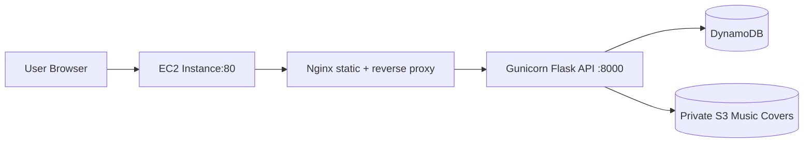

# EC2 Architecture Details

## Purpose
This architecture runs both frontend and backend directly on a single EC2 instance using Nginx (static + reverse proxy) and Gunicorn (Flask API).

Base OS target for this implementation is Ubuntu 24.04 LTS.

## Compliance Notes
- AWS-only runtime and services.
- No Elastic Beanstalk.
- Public access exposed on standard ports `80`/`443` only.
- IAM constraint: use pre-created `LabRole` (no new IAM role creation).

## Diagram

## Resource Naming Strategy
Use an `ec2a-` prefix for EC2 compute resources and `shared-` prefix for data resources:
- EC2 instance name: `ec2a-music-app`
- Security group: `ec2a-music-sg`
- IAM role: pre-created `LabRole` from lab environment
- Repository branch for deployment automation: `main`
- Shared DynamoDB tables:
  - `music_shared_users`
  - `music_shared_songs`
  - `music_shared_subscriptions`
- Shared private S3 bucket: `music-shared-private-covers-<account>-<region>`

## Connectivity Model
- Frontend URL: `http://<ec2-public-dns>/login.html`
- API URL: `http://<ec2-public-dns>/api/*`
- Both are served from the same EC2 host, so CORS can be narrowed to that host.

## Security Model
- Pre-created `LabRole` provides DynamoDB + S3 access.
- Frontend stores login state only in `sessionStorage`.
- `main.html` performs an immediate redirect to `login.html` when no authenticated session exists.
- Nginx exposes only port 80 publicly; Gunicorn remains private on loopback port 8000.

## DynamoDB and Query Design
- Song lookup table uses composite key (`title`, `artist_year`) for deterministic item reads.
- LSI `TitleAlbumIndex` supports title+album access patterns.
- GSI `ArtistYearIndex` supports artist/year lookup patterns.
- Query-first strategy is used; Scan is fallback for broad regex search.
